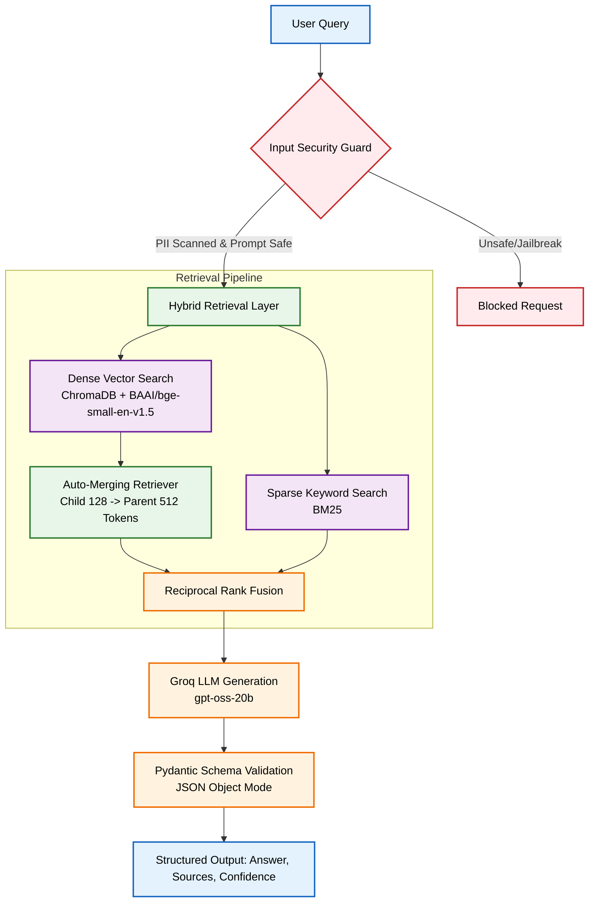

# Guarded Hybrid RAG Architecture for Music Production

A privacy-preserving, local-embedding guarded hybrid RAG system with hierarchical auto-merging retrieval, designed to answer beginner music production questions without relying on paid OpenAI APIs.

## System Architecture



## Core Features

### 1. Privacy & Injection Guardrails

* **Prompt Injection Protection**: Evaluates user input against a strict safety policy using LlamaGuard (`openai/gpt-oss-safeguard-20b`).


* **PII Anonymization**: Utilizes Microsoft Presidio (`presidio-analyzer`) backed by spaCy's transformer model (`en_core_web_lg`) to perform in-memory, offset-safe redaction of sensitive identifiers before any data leaves the local environment.


### 2. Hierarchical Auto-Merging Retrieval

* Documents are chunked hierarchically using `HierarchicalNodeParser` (128-token child leaves for high-precision search, 512-token parent blocks for context retention).
* The `AutoMergingRetriever` scans leaf nodes and dynamically expands them into their full parent context when a majority threshold is met, ensuring the LLM understands full signal routing chains and workflows.

### 3. Hybrid Fusion Engine

* **Dense Search**: Captures semantic intent using local CPU embeddings (`BAAI/bge-small-en-v1.5`) backed by ChromaDB.


* **Sparse Search**: Executes exact-match keyword queries using `BM25Retriever` to catch specific plugin names or audio formats.
* **Reciprocal Rank Fusion (RRF)**: Merges and reranks the results from both retrievers to identify the absolute best context chunks.

### 4. Zero-Cost, Structured Generation

* **LLM Inference**: Powered by Groq's free-tier inference engine running `openai/gpt-oss-20b`.


* **JSON Object Mode**: Forces the reasoning model to bypass standard text channels and output directly into strict JSON format.
* **Pydantic Validation**: Guarantees the final output contains an `answer` string, a validated `sources` array, and a `confidence` float score.


## Quick Start Setup

### Prerequisites

* Python 3.10+
* Groq API Key (Free tier)


### Installation

```bash
pip install llama-index-core llama-index-embeddings-huggingface llama-index-vector-stores-chroma chromadb
pip install groq langchain-groq presidio-analyzer pydantic datasets
pip install llama-index-retrievers-bm25 llama-index-llms-groq llama-index-storage-docstore-default
python -m spacy download en_core_web_lg

```
